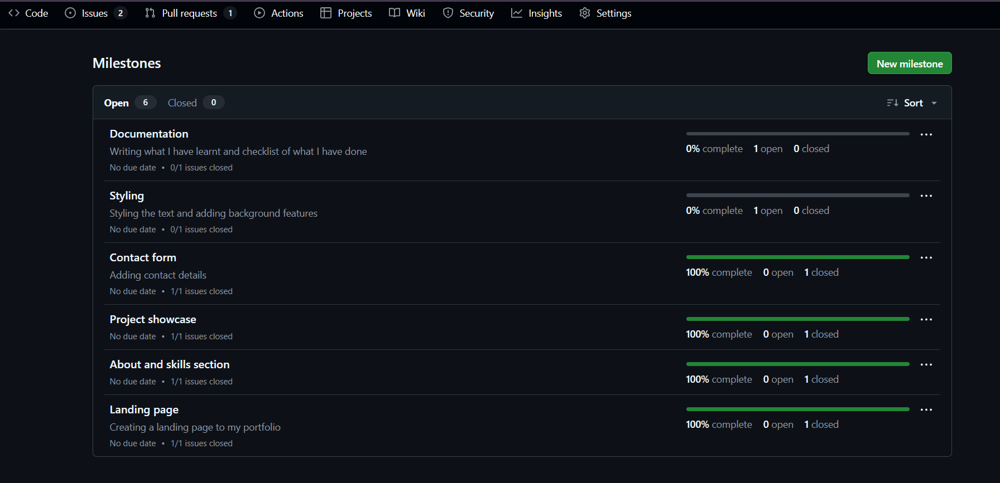
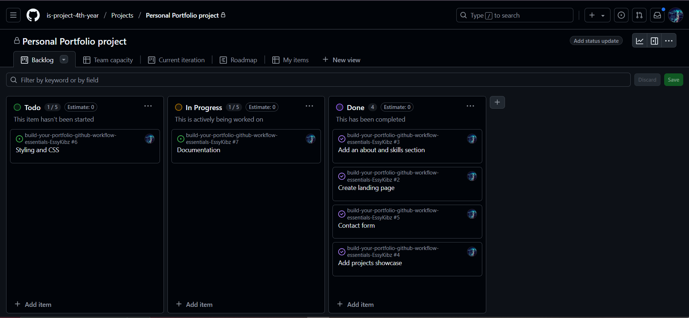
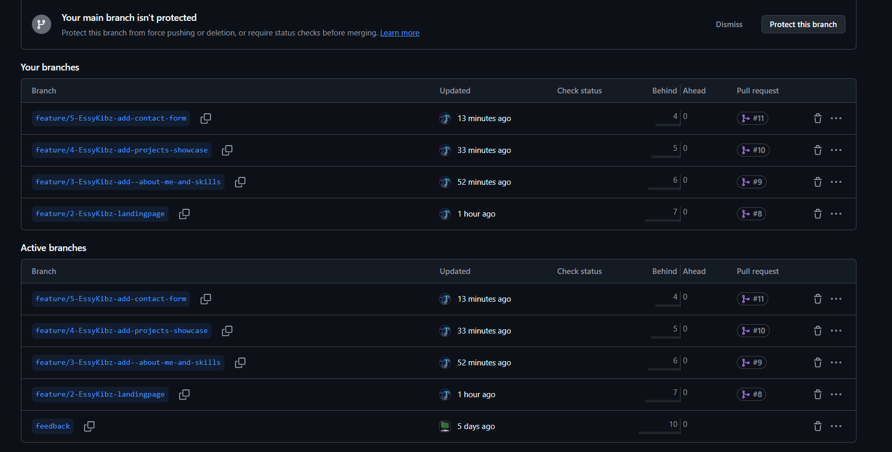
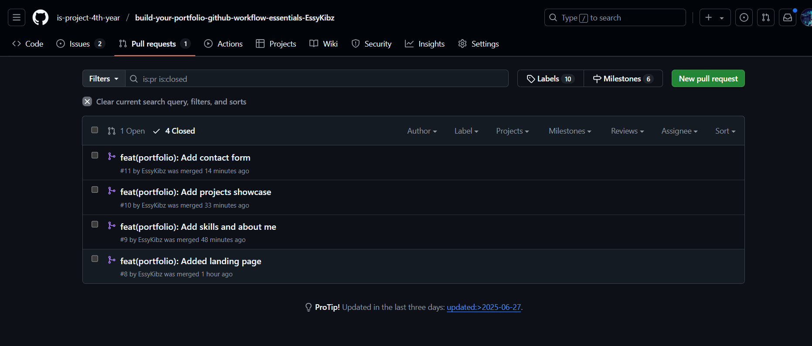
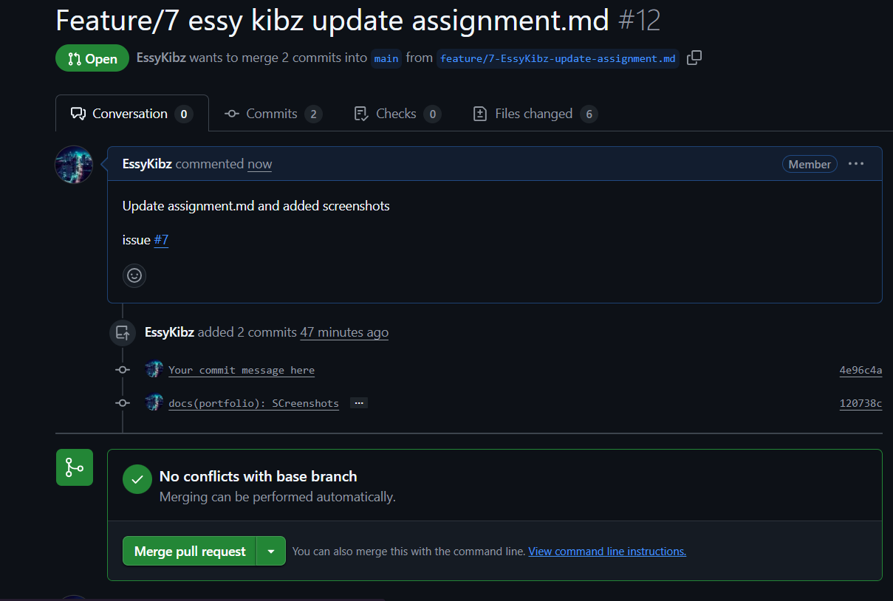

# Personal Portfolio Documentation

## 1. Student Details

- **Esther Kibugi**:
- **151096**:
- **EssyKibz**:
- **estherkibugi030@gmail.com**:

## 2. Deployed Portfolio Link

- **GitHub Pages URL**:  
  _(Provide the live link to your deployed portfolio website)_

## 3. Learnings from the Git Crash Program

Write about **4 things** you expected to learn during the Git crash course (yes, we all came in with some big hopes 😅).
For each one, mention:

What you thought it would be like **(Expectation 👀)**

What you actually learned **(Reality 😅)**

And how it helped with your personal portfolio project 💻

make it honest—and if it surprised you, even better!

Example format:

**🧠 What I Thought I'd Learn vs What I Actually Learned**


## **🧠 What I Thought I'd Learn vs What I Actually Learned**

---

### **1. Concept: Branching**

`Expectation 👀`: I thought branching was only useful for large teams building massive software—not something I'd need for a personal portfolio.

`Reality 😅`: I learned that branching is essential even for solo projects. It gave me a safe space to try out new sections like animations or layout changes without damaging the main site.

`Impact 💡`: I used feature branches like `feature/landing-page` and `feature/contact-section` to test and build each part of the portfolio. It made the development process more organized and stress-free.


### **2. Concept: GitHub as a Code Storage Tool**

`Expectation 👀`: I assumed GitHub was just an online storage space where I could upload my files occasionally.

`Reality 😅`: GitHub is more like a control center—with issues, pull requests, project boards, and tracking. It’s a full-on workflow and project management tool.

`Impact 💡`: I used the GitHub Project Board to visually organize my progress. Seeing my tasks move from “To Do” to “Done” was motivating and made the whole portfolio feel like a real project.

---

### **3. Concept: Commit Messages**

`Expectation 👀`: I didn’t think commit messages mattered much—I planned to just write “update” or “final version” and move on.

`Reality 😅`: Commit messages are like a diary for your project. Meaningful messages helped me (and anyone reviewing) track what changed and why.

`Impact 💡`: I used structured messages like `feat(about): add profile summary` and `fix(nav): resolve mobile nav bug`, which made reviewing and merging my work much easier.

---

### **4. Concept: Merge Conflicts**

`Expectation 👀`: I thought Git would always handle merges cleanly, and I’d never have to worry about conflicts.

`Reality 😅`: Merge conflicts are very real, especially when multiple branches touch similar code. But I learned how to identify, resolve, and document them properly.

`Impact 💡`: I simulated a merge conflict in my portfolio project (as required), resolved it manually in VS Code, and committed with a clear message. It gave me confidence to work on collaborative projects later on.


## 4. Screenshots of Key GitHub Features

Include screenshots that demonstrate how you used GitHub to manage your project. For each screenshot, write a short caption explaining what it shows.

> Upload the screenshots to your GitHub repository and reference them here using Markdown image syntax:
> (you could just simply copy and paste the image into the Assignment.md)

```markdown

```

### A. Milestones and Issues

- Screenshot showing your milestone(s) and the issues linked to it.


### B. Project Board

- Screenshot of your GitHub Project Board with issues organized into columns (e.g., To Do, In Progress, Done).

### C. Branching

- Screenshot showing your branch list with meaningful naming.

### D. Pull Requests

- Screenshot of a pull request that’s either open or merged and linked to a related issue.

### E. Merge Conflict Resolution

- Screenshot of a resolved merge conflict (in a pull request, commit history, or your local terminal/GitHub Desktop).
